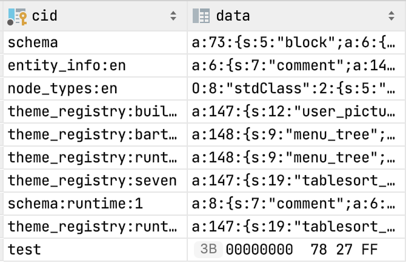

# DRAFT: Handling PostgreSQL bytea (BLOB) fields in SQL, PHP, Drupal

While I was upgrading a very old Drupal 6/PostgreSQL website to Drupal 7, I encountered enough issues around wrong(ly encoded) values in both query input and output... that I couldn't remember how they fit together. The logical next step is trying to write an overview of the issues that I could refer to in the future when I'd forget the details again.

This turned into a rabbit hole as I discovered related outstanding issues across Drupal 6 to 9 (and discovered flaws in some of my earlier assumptions and at least one assumption made by Drupal). The result is the text below.

It's probably not good for publishing as e.g. a drupal.org documentation page because its primary purpose is to be a reference for several related things (to be browsed later if needed / to be sure I still have all my assumptions in order), not a tutorial. So unless someone has another idea about it - it'll live on my blog.

## Main gotchas

The biggest cause of confusion turned out to be usage of backslashes: when are they escape characters (and when do we even need to double-escape values) and why exactly? This depends on PostgreSQL version and parameters (PostgreSQL settings). For any software that wants to support PostgreSQL versions older than 9.1 (say, Drupal 7) this can be a challenge.

Another more minor challenge is keeping in mind when we are looking at an actual string vs. a string representation of a byte value.

(And then, there's confusion stemming from Drupal issues which aren't always clear - even some which are marked as 'fixed'.)

## Escaped string representations in SQL statements

PostgreSQL has two characters it uses as a prefix to 'escape' other characters inside strings, in expressions used in SQL statements.

Let's address the simples one first: the single quote (') is only used to escape another single quote, and works the same in any kind of string representation. It is only used as an escape character in SQL expressions; not in results returned from the server. This means the SQL expression `''''` represents _a single character_.
```
    select '''', length('''');
     ?column? | length
    ----------+--------
     '        |      1
    (1 row)
```
The other one is the backslash (`\`)... sometimes. For the purpose of this text, we'll highlight the following:

* Backslashes are only seen as an escape character if the `standard_conforming_strings` parameter is set to 'off'. If it is 'on', a backslash is just another character in the string. It's 'on' by default since PostgreSQL 9.1.
* Significant escape sequences, i.e. characters following the backslash, are:
  * up to three digits 0-7: interpreted as a character with the corresponding octal byte value. (Any further and/or higher digits are seen as literal characters.)
  * \x + one/two hex digits: interpreted as a character with the corresponding hexadecimal byte value.
  * A full list of escape sequences, and references to other parameters influencing them, is available in PostgreSQL documentation about [C-Style Escapes](https://www.postgresql.org/docs/current/sql-syntax-lexical.html#SQL-SYNTAX-STRINGS-ESCAPE).
* Most characters with a trailing backslash are just interpreted as that single character, e.g. `'\\'` is a single backslash and `'\''` is a single quote _if `standard_conforming_strings = off`_. Do not use `\'` though; it's potentially insecure. (By default `standard_conforming_strings = on`, `'\''` is an unterminated first part of a string. See more references to info in above link, if interested.) Use `''''` instead.

PostgreSQL has a string notation which always interprets those escape codes regardless of PostgreSQL version/parameters: `E'<string value>'`. This can be useful, given that 'regular' strings are ambiguous and nowadays don't treat a backslash as an escape code. We won't do much with this notation in this text except mention them for completeness in several places.

Note that escaped characters are not byte values, they are _characters_ (with a corresponding byte value). The effect is that not all character codes are valid; you may get an error like "invalid byte sequence for encoding "UTF8": 0xff".[fn]I'm not sure exactly what causes this; I didn't get such errors when connected to a PostgreSQL 13 server/database with encoding SQL_ASCII and client_encoding "UTF8", but did get them when connexted to a PostgreSQL 8.4 server/database with the same encodings. This is outside of the scope of this text, so I didn't check.[/fn]

*Takeaway* from this section: in an SQL statement, the expression `'\x58''\x78'`
* usually (if `standard_conforming_strings = on`, by default since PostgreSQL 9.1) represents a nine-character string: `\x58'\x78`
* but could (if `standard_conforming_strings = off`, by default for older versions) represent a three-character string: `X'x`

### Escape sequences in strings converted to bytea

In SQL expressions ('input') and/or results returned from the server, bytea data needs to have some kind of character representation.

For SQL, there are two distinct types of strings which can be implicitly used as (or explicitly converted to) bytea:

First, regular strings where any occurring backslash is used as an escape code to represent a single byte, when followed by:
* exactly three octal digits between 000 and 377;
* another backslash (the resulting byte being 0x5c, i.e. one backslash).
All escape sequences _and_ all other single characters are each converted to a single byte with the corresponding value. If a string contains a backslash followed by any other character sequence,  using that string in a bytea context raises an `ERROR:  invalid input syntax for type bytea`.

Secondly, a string that starts with characters '\x' followed by pairs of hexadecimal digits - where each pair may or may not be separated by whitespace. Each digit pair is converted to a single byte with the corresponding value. Any other characters encountered in the string will raise the same error if it is used in a bytea context.[fn]'Using a string in a bytea context' is e.g. using it in an UPDATE statement to update into a bytea column, or explicitly converting it using e.g. `'string'::bytea`. The explicit conversion used to be necessary, i.e. we could not simply UPDATE a string value into a bytea field, until PostgreSQL 7.2.2, according to A [note in PHP docs](https://www.php.net/manual/en/function.pg-unescape-bytea.php).(7.2.2 was released in August 2002.)[/fn]

The second notation is valid since PostgreSQL 9.0.

More information on both input at output notation, written up a bit differently, is available in in PostgreSQL documentation about [Binary Data Types](https://www.postgresql.org/docs/current/datatype-binary.html).[fn]An observation: the PostgreSQL documentation mentions `''''` as a valid 'escaped input representation' for a single quote. While that is true, I find this a bit misleading: this is _an escaped representation of a single character_ - whereas the 'escaped input representation' `'\\'` is a string containing _two actual backslash characters_, which are converted to a single byte '\' upon conversion to bytea.[/fn]

Note that these are strings containing _actual backslash characters_ inside the string, unlike the previous section which covered _string notations using backslashes_ to represent a single character. Note also that the '\x' notation in the two sections is different. Combining the two different sections results in:

If `standard_conforming_strings = off`, 
* `'\a'` is a single-character string that can be used as a single-byte value.
* `'\130\170'` and `'\x58\x78'` are representations of two-character strings (equal to `'Xx'`) that can be used as two-byte values.
* `'\x5878'` is a three-character string (`X78`) that can be used as a three-byte value.
* `'\\'` is a single-character string that cannot be converted to bytea. (`'\\'::bytea` raises an error.)
* `'\\x5878'` is a six-character string that can be used as a two-byte value.

(The use of `\x`, `\\` and `\a` in these strings by default is allowed but will raise a warning. which could be suppressed by prefixing the string with an `E`, which will turn it into PostgreSQL's escape notation regardless of `standard_conforming_strings` value.)

If `standard_conforming_strings = on` (default since PostgreSQL 9.1),
* `'\a'` is a two-character string that cannot be converted to bytea.
* `'\130\170'` is an eight character string that can be used as a two-byte value.
* `'\x58\x78'` is an eight character string that cannot be converted to bytea.
* `'\x5878'` is a six-character string that can be used as a two-byte value.
* `'\\'` is a two-character string that can be used as a single-byte value.
* `'\\x5878'` is a seven-character string that can be used as a six-byte value. (Which corresponds to the six characters `\ x 5 8 7 8`.)

### Representing bytea ('BLOB') data in SQL statements

_(I wrote this section before being able to summarize things above. This may contain duplicate information, but I'm leaving it in, in shortened form.)_

The following expressions are all SQL representations of the same two-byte value, which can be e.g. printed back in the psql client using a simple `SELECT <expression>;` statement, or inserted/updated into a column using e.g. `update cache set data = EXPRESSION where where cid='test';`:

    decode('5878','hex')

This expression takes '5878' to be an encoded hex value and converts it back to a byte value. This kind of expression can unambiguously represent any byte value.

    'Xx', E'\130\170' or E'\x58\x78' (or E'\x58x', etc) or U&'\0058x'

These are all unambiguous representations of the exact same two-character string which can be _converted_ to a two-byte value.

    '\130\170', and '\\130\\170' & '\x58\x78' for standard_conforming_strings = off.

If `standard_conforming_strings = off`,

* `'\130\170'` and `'\x58\x78'` are two-character strings that can be converted to two-byte values; like above, only certain character sequences are allowed. A warning is raised[fn]depending on the `escape_string_warning` parameter[/fn]: `WARNING:  nonstandard use of escape in a string literal [specification] HINT:  Use the escape string syntax for escapes, e.g., E'\r\n'.`

* `'\\130\\170'` is an eight-character string that can be converted to a two-byte value (where any values are allowed). A warning is raised[fn]depending on the `escape_string_warning` parameter[/fn]: `WARNING:  nonstandard use of \\ in a string literal [specification] HINT:  Use the escape string syntax for backslashes, e.g., E'\\'.`

If `standard_conforming_strings = on`,

* `'\130\170'` is the same eight-character string that can be converted to a two-byte value (where any values are allowed).

* `'\\130\\170'` is a ten-character string. When converting a string to a bytea value, double backslashes are seen as one escaped backslash so this gets converted to an eight-byte value (corresponding to the eight characters '\130\170').

* On PostgreSQL 8, using the eight-character string `'\x58\x78'` in a bytea context raises an `ERROR:  invalid input syntax for type bytea`.

* On PostgreSQL 9(.0/1?), using `'\x58\x78'` in a bytea context raises an `ERROR:  invalid hexadecimal digit: "\"`. This is because of the '\x' syntax discussd just below, and is the reason that just the four-character string `'\x58'` is usable as a single byte.
```
    E'\\x5878' for PostgreSQL >= 9
```
This represents a six-character string '\x5878', which can be converted to a two byte value. They are valid in _(I am almost sure)_ PostgreSQL >= 9.0 or 9.1.[fn]I haven't seen specifications of when this syntax was first allowed.[/fn] In PostgreSQL 8, these expressions cannot be used to represent bytes, and raise an error `invalid input syntax for type bytea`.[/fn]

    '\x5878' or '\\x5878', depending on `standard_conforming_strings`.  

These also are invalid in PostgreSQL 8 (except the 'escaped backslash' from the last bullet).

If `standard_conforming_strings = off`,

* `'\x5878'` actually represents a three-character string 'X78' that can be converted to a three-byte value; like above, only certain character sequences are allowed and a warning is raised about "nonstandard use of escape", like `'\130\170'`.

* `'\\x5878'` represents a six-character string that be converted to a two-byte value (also representable by 'Xx'); any values are allowed, and a warning is raised about "`nonstandard use of \\`", like `'\\130\\170'`.

If `standard_conforming_strings = on`,

* `'\x5878'` is a six-character string that is converted to a two-byte value (corresponding to two characters 'Xx').

* `'\\x5878'` is a seven-character string that be converted to a six-byte value (corresponding to the six characters '\x5878') - on all PostgreSQL versions.

## How bytea data is represented on output (by psql)

Before PostgreSQL 9.0, bytes were always displayed as characters where possible, and otherwise as escaped octal sequences. For instance the six byte sequence `decode('275c787e227f', 'hex')` is output as `'\\x~"\177` - where the last byte is represented as an escaped number, the second byte (5c) is an _escaped_ (i.e. double) backslash, and the other 4 bytes are single characters.
```
    select decode('275c787e227f', 'hex');
       decode
    ------------
     '\\x~"\177
```
In PostgreSQL 9.0, the `bytea_output` parameter was introduced and the default output was changed. For `bytea_output = 'escape'`, the value will be  output the same as before (above); for the new default `bytea_output = 'hex'`, the value will be output as `\x275c787e227f`.

Notes:
* The `bytea_output` parameter does not influence input; both kinds of escaped values are allowed simultaneously, as documented in an earlier section. Analogous to this, the `standard_conforming_strings` parameter does not influence this output, only input values.
* These 'output' values returned as query results are not necessarily suitable to be used in SQL expressions / as an 'input' value. The string '\x275c787e7f' may or may not be suitable as an input value, depending on the value of the `standard_conforming_strings` parameter, discussed above. An output value containing a single quote is never suitable, since these are not escaped - and must be escaped (by prepending another single quote) for use in SQL.
* The above two returned expressions both are not strings; they are still text representations of six bytes. Only when converted to a varchar (with `EXPRESSION::varchar`) do they turn into a real string - as noticeable by the fact that eg. their `length()` changes (from 6 to 10 or 14 respectively).

## Other clients

All SQL clients are of course free to represent database contents however they see fit. As an example here's a screenshot of how PHPStorm's built-in database viewer represents bytea data:



As seen above, PHPStorm presents byte sequences that 'happen to' correspond to readable characters as a character string (and enables editing that string) - and other bytes as hexadecimal number pairs (which are not editable).

This presents a challenge: depending on the way we use this data, we have to keep in mind that the data we are looking at is not an actual character string but a string representation of a byte value. (As will be discussed below, backslashes in the _apparent_ character string are actually escaped when fetching data through php-pgsql - though not when fetching data through PDO.)

## php-pgsql

The pgsql PHP extension just sends SQL statements through and retrieves data rows, without doing much processing by itself.

A query result always returns an encoded string for a bytea value - i.e. the above two-byte example field as either `Xx` or `\x5878` (default since PostgreSQL 9) depending on the `bytea_output` parameter.

And e.g. the statement`$res = pg_query($connection, "update cache set data='\\x5878' where cid='test';");` updates either a three- or two-byte value, depending on the `standard_conforming_strings` parameter (or cannot work for PostgreSQL <9.1 with `standard_conforming_strings = on`), like documented above.

Note the double backslash is necessary because PHP needs the backslash escaped if it's part of a double quoted string. (`"\x5878"` is a three-character string 'X78' in PHP; `"\\x5878"` is a six-character string starting with a single backslash, which is what PostgreSQL gets passed as the expression in the SQL statement.)

There are two helper functions to encode/decode bytea values:

`pg_unescape_bytea( string )` can be used on a column / return value in a query result (which always returns an escaped value just like SQL does), to convert an escaped string back to bytes.[fn]`pg_unescape_bytea()` predates the `bytea_output = 'hex'` parameter/format, and apparently didn't work with this format for a short while after it was introduced - but that was later fixed.[/fn]

As a rule of thumb, this must be called exactly once, on every result set value retrieved from a bytea column using `pg_query()`. (Because the values are always escaped values, never literal byte values.[fn]There may well be modifiers to php-pgsql functions which alter this fact, but I don't know about them.[/fn] See also Drupal 6 notes on why they sometimes don't _look like_ they are.) The function is _not_ reentrant / must only be called on a string that is actually escaped; calling it on an already-unescaped string that contains backslashes will make (some of) the backslashes disappear.

`pg_escape_bytea( [connection,] string )` can be used to escape a byte value so it is usable in an SQL statement. Its _first_ (connection) parameter is optional. If it is omitted, the connection last opened (by `pg_connect()`) is taken as default. So, return values of `pg_escape_bytea( string )` differ depending on the last opened connection.

1) When no connection is opened:

Same behavior as point 2. (Probably for backward compatibility.)

2) When the connection is to a PostgreSQL 8 server and `standard_conforming_strings = off`:

* Most printable characters are not escaped.
* Byte value 0x27 (which corresponds to a single quote character) is escaped by adding another quote: `''`
* Byte value 0x5c (which corresponds to a backslash character) is double-escaped, i.e. converted to _four_ backslashes. 
* Non-printable bytes are double-escaped individually, i.e. Two byte values `0x7f, 0x7f` get converted to the ten-character string `\\177\\177`.

3) When the connection is to a PostgreSQL 8 server and `standard_conforming_strings = on`:

Same behavior for most printable characters and single quotes; backslashes and non-printable characters others are 'normally' escaped with a single backslash (so two byte values `0x7f, 0x7f` get converted to the eight-character string `\177\177`. 

4) When the connection is to a PostgreSQL 9+ server and `standard_conforming_strings = off`:

All bytes are encoded as hex digits, prepended with `'\\x'`.

5) When the connection is to a PostgreSQL 9+ server and `standard_conforming_strings = on` (default since PostgreSQL 9.1):

All bytes are encoded as hex digits, prepended with `'\x'`.

The compounded escaping behavior in points 2 & 4 accommodates for two separate things that were discussed in two sections above:
* First, the byte value is turned into a proper string representation, by (for 4-5) turning it into a 'hex notation' string or (for 1-3) turning non-printable characters into octal escape sequences - to accommodate for the unescaping that will be done when this string is converted back to a bytea value.
* Then the string into a properly escaped string representation, usable in SQL, by escaping all single quotes plus only if `standard_conforming_strings = off`: escaping  all backslashes (including those added in the previous point).

`pg_escape_bytea()` and `pg_unescape_bytea()` are not symmetric, i.e. running a value through both functions does not necessarily produce the original results. They aren't meant to be symmetric, because the 'input' syntax of expressions in SQL statements is not equal to the 'output' syntax of escaped strings returned in query results. (As noted in the section on How bytea data is represented on output.)

`pg_unescape_bytea()` apparently did not work for early versions of PostgreSQL 9 / php-pgsql, when `bytea_output = 'hex'`.[fn]https://www.php.net/manual/en/function.pg-unescape-bytea.php#100436 refers to this bug, which is likely connected to [a similar 'escaping' bug in PDO filed against Drupal 7.0-alpha/beta](https://www.drupal.org/project/drupal/issues/926636) which seems to also have disappeared since; see the D7 section for more.[/fn]

## Drupal 6

Drupal 6 Core works with php-pgsql. Its contains its own layer for sanitizing 'input' data to prevent SQL injection attacks. Code is expected to use it by replacing string data with `'%s'` in SQL statements and passing actual input values in a separate parameter to its `db_query()` function.

For bytea data (BLOB in Drupal/MySQL terms), `%b` needs to be used instead. The Drupal database layer will call `pg_escape_bytea()` (through its own wrapper function called `db_encode_blob()`), so encoding of binary data is handled transparently. This way, binary/byte data can just be passed into `db_query()` to be added into an SQL function.

Decoding of returned data is not done transparantly; if a result sets contains a binary field, `db_decode_blob()` should be called on its values to `pg_unescape_bytea()` its data.

For MySQL (the standard database system for Drupal), `db_encode_blob()` / `db_decode_blob()` just return the original passed-in value because MySQL has no special processing for binary data.

Drupal typically uses bytea/BLOB fields for storing serialized data. (I have not seen an example of inserting arbitrary byte data into D6 and am not completely sure how that would best be done with MySQL, given its apparent lack of encoding any byte values in an SQL statement.)

The reason for using bytea/BLOB fields for this are:
* _Arbitrary_ serialized data can contain null (\0) characters (used with with protected/private properties of a serialized class). PostgreSQL apparently silently cuts off the value stored in a text column, at the first occurrence of a null byte. MySQL apparently handles this situation well.[fn]Derived from the report in https://www.drupal.org/project/drupal/issues/690746.[/fn]
* Ability to store non-null non-UTF8 data that is inside a serialized value. MySQL apparently silently cuts off the value stored in a text column, at the first occurrence of such data.[fn]This is mentioned in https://www.drupal.org/project/ctools/issues/865142.[/fn]
I find this worth noting explicitly, because at first sight, most of Drupal's bytea field contents seem perfectly readable by a human - which means a number of things can become unclear or confusing:
* We should remember that these are not text fields but really byte values (where the vast majority of byte values happen to coincide with readable characters). This means e.g. we should be careful how we treat these values in SQL queries, exports, etc.
* If `bytea_output = 'hex'`, result sets containing these byte values will all of a sudden be unreadable to humans. This is perfectly fine / intended, even though it's confusing at first sight.
* If `bytea_output = 'escape'`, result sets containing these byte values will look readable but must not be used as-is because they are still escaped. In practice, only backslashes, null characters and non-UTF8 characters are escaped, so most serialized strings _look_ like they're OK to use, but in principle they're not.
* While the bytea values in result sets look vastly different depending on the `bytea_output` setting for the connection / database / server, they should be treated exactly the same way: call `db_decode_blob()` on them.

Since `db_encode_blob()` / `db_decode_blob()` does nothing for MySQL, we need to be prepared for PostgreSQL bugs where serialized data cannot be unserialized because
* BLOB data is inserted using `'%s'` instead of `%b` (which removes literal backslashes in the saved PostgreSQL values, because it expects strings to be escaped, and unescapes them before being used as bytea), and/or
* `db_decode_blob()`is not called (which means returned field values are either illegible '\x......' strings or have some values escaped with backslashes).

### Where are bytea (BLOB) fields used:

* `cache.data` / `cache_form.data` / `cache_menu.data` / `cache_page.data`. This column contains a serialized string, so it may seem strange to store this in a bytea field instead of a regular text field. However, _arbitrary_ serialized data can contain null (\0) characters (used with with protected/private properties of a serialized class), and it is impossible to just insert these null characters as part of a string value inserted into an SQL command.[fn]The insert command will not fail but the serialized string will be cut short (so it will fail to deserialize on read). This was detailed in https://www.drupal.org/project/drupal/issues/690746 for D7 / PDO, but testing shows that it also holds for D6 / db_query(). I can't deduce whether unserialize() failures were the exact reason was for moving to bytea/BLOB columns for cache tables (which was done in D4.7 in https://www.drupal.org/project/drupal/issues/10407 for PostgreSQL and later in https://www.drupal.org/project/drupal/issues/40532 for MySQL.)[/fn]

* `sessions.session`, since 6.38, as a result of security issue https://www.drupal.org/SA-CORE-2016-001. This fix broke sessions on PostgreSQL because it forgot to change `'%s'` to `%b` in SQL statements and to `db_decode_blob()` query results, so sessions on PostgreSQL are broken. https://www.drupal.org/project/d6lts/issues/2687401 contains the fix.

* As far as often-used Contrib goes, we've seen `views_view.view_php` is a bytea/BLOB field.

Also, notably,

* `locales_source.source` and `locales_target.translation` are text for PostgreSQL while they are blob for MySQL. Reason given for the difference: blobs are used "to enforce case sensitivity in MySQL" which doesn't apply for PostgreSQL where text is already case sensitive. [fn]Issue which changed blob back to text for PostgreSQL only in D5: https://www.drupal.org/project/drupal/issues/93506.[/fn] 

* `views_object_cache.data` used to be a bytea field; it was later changed to text "to increase its size".[fn]I'm not completely sure what to think of the change from blob to text. https://www.drupal.org/project/views/issues/295246#comment-1186206 explicitly says "the solution is to change views_object_cache.data to a LONGBLOB type" but then the patch that is uploaded 15 minutes later changes it to `text`. I'm not sure if we can assume that this table never contains any 'strange' bytes/characters; _provided_ it doesn't, the change to `text` is IMHO an improvement. For completeness: the patch was incomplete because the 'get' side removed the `db_decode_blob()` part, but the 'set' side still had the `%b` in. Commit #cf3aace changed that a few weeks later. In D7, `views_object_cache` is removed and its data is moved into `ctools_object_cache`, which does get changed to BLOB for this reason.[/fn]

* `views_display.display_options` used to be a bytea field; it was later changed to `text` "to increase its size" but the change was incomplete.[fn]Only the column type was changed but no `db_decode_blob()` invocations were removed from code fetching data from this table. Code writing data doesn't need to be amended because that code (`views_db_object.save_row()`) is abstracted to handle this situation.[/fn]A patch for the resulting PostgreSQL bug is posted at https://www.drupal.org/project/views/issues/466250#comment-14092595. (This column is the only one that's still `text` in D7.)

* ctools_object_cache.data was also changed from blob to text at some point, but the field handling code wasn't completely changed accordingly; a fix for the remaining PostgreSQL bug has been posted at https://www.drupal.org/project/ctools/issues/495240#comment-14092589. On the other hand, it seems the change was mistaken and the field should have been changed to a `blob / big` column instead; see https://www.drupal.org/project/ctools/issues/865142.


## PDO / parameterized queries.

PDO can bind (PHP variables containing) byte data to an insert / update query. The only thing that needs to be done specifically, is to set the correct type in the `bindParam()` / `bindValue()`; PDO will take care of things by itself.
```php
$data = file_get_contents("testimage.jpg");
$sql = "INSERT INTO testblob(id, data) values (:id, :data)";
$stmt = $conn->prepare($sql);
$stmt->bindParam / bindValue(':id', '1', PDO::PARAM_INT);
$stmt->bindParam / bindValue(':data', $data, PDO::PARAM_LOB);
$stmt->execute();
```
In general, there doesn't seem to be a need to bind non-bytea columns to a specific type, so the third argument to `bind*()` is only required for the `:data` column.[fn]I'm sure I'm disregarding some situations here, but this is not a PDO reference text. One thing I've seen mentioned somewhere is that super high numbers could give issues when not bound with `PDO::PARAM_INT` - probably dependent on PHP/PDO version and/or integer size.[/fn]

For retrieving data, PDO by default returns a stream resource for a bytea field value; the field contents can be fetched by reading the stream. The `PDO::ATTR_STRINGIFY_FETCHES` connection option changes this to return the field contents directly.

In either case, the non-escaped byte value is returned, so we never see either of the `bytea_output` formats.
```php
$driver_options = [
  PDO::ATTR_STRINGIFY_FETCHES => TRUE
];
$conn = new PDO("pgsql:host=localhost dbname=$dbname", $user, $pass, $driver_options);

$sql = "SELECT id, data FROM testblob WHERE id = 1";
$stmt = $conn->prepare($sql);
$stmt->execute();
$row = $stmt->fetch(PDO::FETCH_ASSOC);
// $id = id (int or string) 
// $data = resource or string
$data = empty(driver_options[PDO::ATTR_STRINGIFY_FETCHES] 
  ? stream_get_contents($row['data']) : $row['data'];
```


TODO say that this apparently didn't always work? (ref. #926636)

## D7

Drupal's `DatabaseConnection_pgsql` sets `PDO::ATTR_STRINGIFY_FETCHES` so bytea field data is returned along with all other fields. `InsertQuery_pgsql` / `UpdateQuery_pgsql`, with the help of its database schema info, take care of adding the `PDO::PARAM_LOB` when needed. So nothing special is needed; all `db_query()` calls should accept / return correct byte data transparently.

-> condition/wheres still being worked on in #2635756 == #2238253. 

Drupal 7.0 added a requirement for setting `bytea_output = escape` on PostgreSQL >= 9. This seems to be unnecessary because (at least according to my testing) [the bug that caused this](https://www.drupal.org/project/drupal/issues/926636) has disappeared. It was probably in PHP-PDO/pgsql somewhere.
****** TODO CHECK. then reference the new issue here, which I'm going to open. <-- or do it in & refer to the TODO just above.

All Core's database tables that store serialized data have been converted to `BLOB` / `bytea` in version 7.0.
*** TODO work out words here for the conversion that is failing. #1031122

As mentioned earlier, `views_display.display_options` is still `text` - and we'll assume that's safe / this serialized column never contains non-UTF8 data.[fn]This is not a consideration for D8 anymore; the table disappeared as  display options were changed into configuration.[/fn] We haven't checked any other contrib modules besides ctools.


TODO words on standard_conforming_strings here?
- how it works (maybe in PDO section)
- if both settings are allowed
  -> no - just because of the conversion needed during #1031122 and because
     of the hack in DatabaseConnection_pgsql::prepareQuery()
     -> TODO check if this also has to do with the str_replace hack in DatabaseConnection_pgsql::__construct() for the password?


*** TODO should I check backdrop? (Silkscreen) Should I mention it in this blog post?

